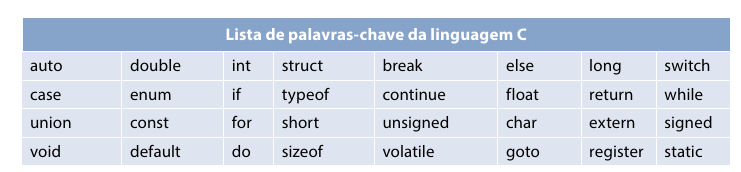
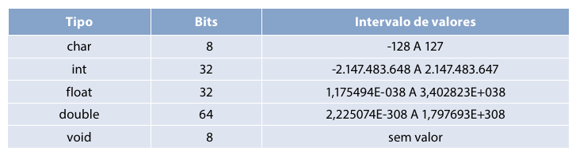
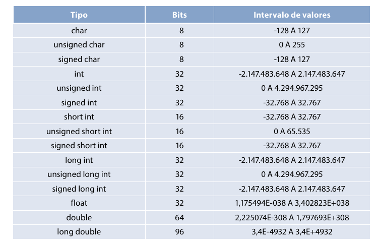
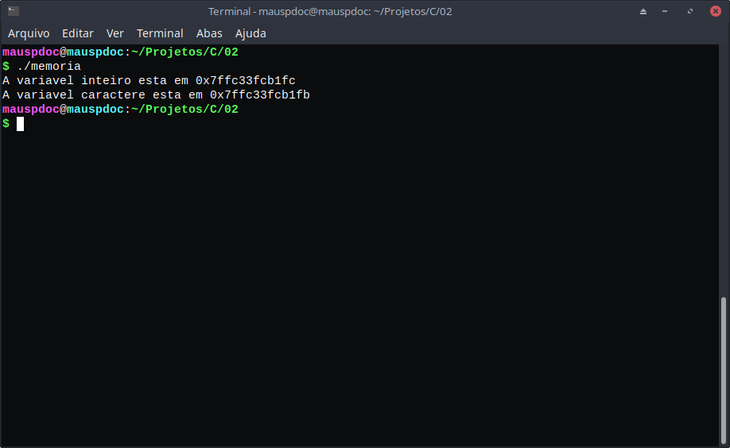
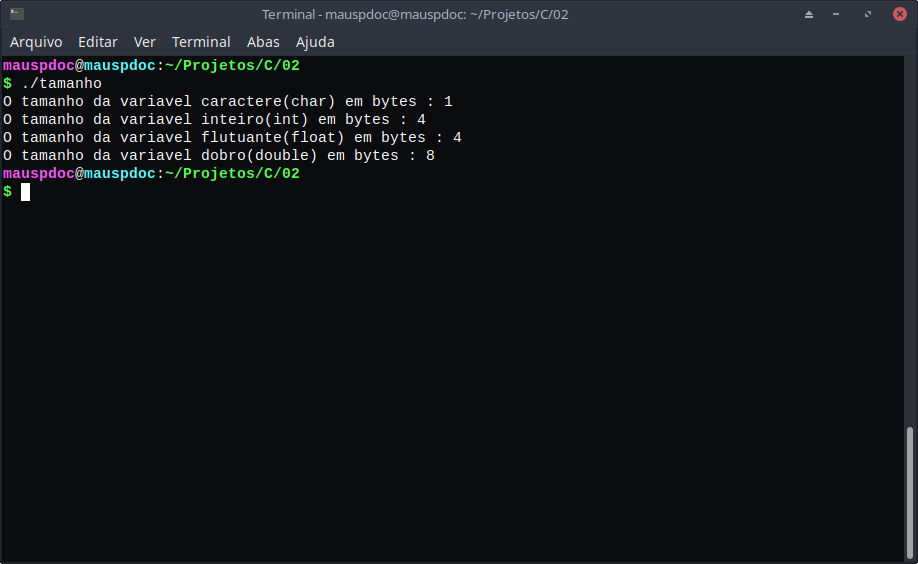
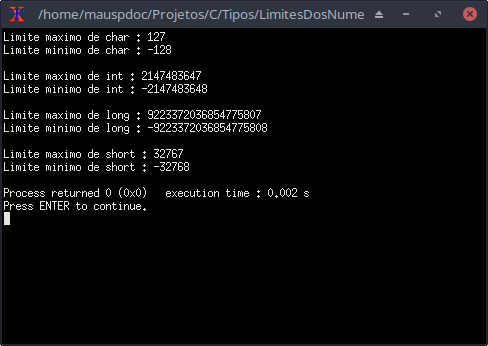

# Variáveis e Tipos

154

## Definindo

Variável é um lugar na memória do computador, nesse espaço podemos armazenar valores e podemos manipular ao escrever o programa. 

Exemplo :

```c
int c;
```

 Estamos usando um espaço da memória para armazenar uma variável do tipo int, que é um número inteiro. Agora vamos atribuir valor para essa variável armazenar :

```c
c = 4;
```

Então, generalizando, podemos dizer a seguinte forma de declarar uma variável :

```
<tipo> <nome_da_variavel> ; # Não esqueça do ponto e vírgula após declarar
```

Se atente ao " ; " , ela sempre está inclusa quando declara uma variável. 

Podemos declarar múltiplas vezes também :

```
<tipo> <variável1> , <variavel2> , <variavel3> , <variavel4> ; 
```

Exemplo :

```c
int n1 , n2 , n3 ;
```

As variáveis n1,n2, n3 possuem o mesmo tipo 'int' , portanto, declaramos 3 variáveis de um mesmo tipo. Elas são separadas por vírgula e após acabar de declarar as variáveis não esqueça do " ; ".

Podemos declarar e atribuir um valor para uma variável em uma linha :

```c
int idade = 19;
```

Generalizando : 

```
<tipo> <nome_da_variável> = <valor>
```

## Nome de variável 

A linguagem C é case-sensitive, ela diferencia palavras escritas usando caracteres maiúsculas das que usam caracteres minúsculos. 

O nome de  uma variável precisa ser algumas regras :

1. Deve sempre começar com uma letra ou ' _ '
2. O conjunto de caracteres da variável precisa ser letra ou número ou " _ "

Essas três palavras Palavra, palavra , PALAVRAS ; para a linguagem C são todas diferentes.

Há palavras que são reservadas para a linguagem C, que não podem ser usadas como nomes de variáveis :



## Tipos

A linguagem C possui basicamente 5 tipos :



Os tipos que se referem a texto são :

* char

O tipo char se refere a um caractere, apenas, esse caractere precisa estar entre aspas simples :

```
char <nome_da_variavel > = '<caractere>'
```

 Exemplo :

```c
char letra = 'a'
```

Estaria errado o seguinte exemplo : 

```c
char letra = 'aa'
```

Isso gera um erro , pois se espera apenas um caractere. 

Os tipos que se referem a números :

* int
* float
* double

o int aceita apenas inteiros como : 1,2,3,4 (... ) . Enquanto que float aceita apenas valores com ponto flutuante ''. ''  como : 1.2 , 4.3 , 6.8 (...) . O tipo double aceita os mesmos valores que o float, entretanto , possui mais precisão, o que pode ser indicado para quem precisa de exatidão. 

> O double possui mais precisão e ainda consegue armazenar mais valores que todos os outros tipos int e float .

## Modificadores de tipos

Os modificadores permitem alterar o comportamento de um tipo, podendo alterar os valores suportados.

* signed
* unsigned
* short
* long

Como introduzir um modificador de tipo :

```
<modificador> <tipo> <nome_da_variavel> ;
```

Exemplo :

```c
unsigned int idade ;
```

O que cada um representa ?

O modificador signed determina que uma variável pode conter valores positivos e negativos, mas isso já é padrão para as variáveis, mesmo sem o signed. Pode ser aplicada para char e int .

O modificador unsigned determina que uma variável do tipo int ou char pode conter apenas valores negativos.

O modificador long determina que variáveis do tipo int e double. A variável do tipo int armazenará mais valores, a variável do tipo double terá mais precisão com o long. 

O short determina que o int armazenará menos valores. 

Tabela com todas as combinações de tipos até aqui :



> Caso queira tirar conclusões próprias de que uma variável está em algum lugar da memória, teste o seguinte código :
>
> ```c
> #include <stdio.h>
> #include <stdlib.h>
> int main(){
>   int inteiro = 2;
>   printf("A variavel inteiro esta em %p \n",&inteiro);
>   char caractere = 'a';
>    printf("A variavel caractere esta em %p \n",&caractere);
>   }
> ```
>
> Ao executar terá um resultado semelhante a esse :
>
> 
>
> A mensagem exibe o local da memória onde se localiza a variável do programa. 
>
> Caso queira ver o tamanho que cada tipo na memória, use o seguinte código :
>
> ```c
> #include <stdio.h>
> #include <stdlib.h>
> int main(){
>   char caractere = 'a';
>   int inteiro = 1 ;
>   float flutuante = 2.0;
>   double dobro = 2.0;
>   
>   printf("O tamanho da variavel caractere(char) em bytes : %li \n",sizeof(caractere));
>   printf("O tamanho da variavel inteiro(int) em bytes : %li \n",sizeof(inteiro));
>   printf("O tamanho da variavel flutuante(float) em bytes : %li \n",sizeof(flutuante));
>   printf("O tamanho da variavel dobro(double) em bytes : %li \n",sizeof(dobro));
> }
> 
> ```
>
> O resultado deverá ser parecido com esse :
>
> 
>
> Lembrando que 1 byte é equivalente a 8 bits.

# Achando os limites 

O limite de um tipo (int/char/float/double) da linguagem C varia bastante de compilador para compilador, mas é possível verificar isso usando a biblioteca limits.h.

A biblioteca limits.h nada mais é do que um arquivo que contém constantes, sendo que essas constantes especificam o limite para cada tipo.

| Constante     | Descrição                 |
| ------------- | ------------------------- |
| **CHAR_BIT**  |                           |
| **CHAR_MAX**  | Máximo valor do tipo char |
| **CHAR_MIN**  | Mínimo valor do tipo char |
| **INT_MAX**   | Máximo valor do tipo int  |
| **INT_MIN**   | Mínimo valor do tipo int  |
| **LONG_MAX**  | Máximo do tipo long       |
| **LONG_MIN**  | Mínimo do tipo long       |
| **SCHAR_MAX** | Máximo do signed char     |
| **SCHAR_MIN** | Mínimo do signed char     |
| **SHRT_MAX**  | Máximo do short           |
| **SHRT_MIN**  | Mínimo do short           |
| **UCHAR_MAX** | Máximo do unsigned char   |
| **UINT_MAX**  | Máximo do unsigned int    |
| **ULONG_MAX** | Máximo do unsigned long   |
| **USHRT_MAX** | Máximo do unsigned short  |

Código exemplo :

```c
#include <stdio.h>
#include <limits.h>
int main(){
	printf("Limite maximo de char : %d \n",CHAR_MAX);
	printf("Limite minimo de char : %d \n\n",CHAR_MIN);

	printf("Limite maximo de int : %d \n",INT_MAX);
	printf("Limite minimo de int : %d \n\n",INT_MIN);

	printf("Limite maximo de long : %ld \n",LONG_MAX);
	printf("Limite minimo de long : %ld \n\n",LONG_MIN);

	printf("Limite maximo de short : %d \n",SHRT_MAX);
	printf("Limite minimo de short : %d \n",SHRT_MIN);


	}
```

Resultado :



