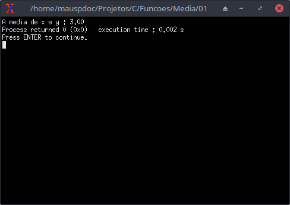

# Funções

Uma função é um pedaço de código que pode ser reutilizado e permite diminuir repetições desnecessárias à medida que o programa cresce.

# Declarando e usando

Vamos analisar o seguinte código :

```c
double media(double a,double b){
    return (a+b)/2;
}
```

Separando por partes :

> ```c
> double media(double a, double b)
> ```

O nome da função é "media", o tipo do valor retornado por ela está indicado por "double" antes do nome da função. Entre parênteses temos o que chamamos de parâmetros, eles indicam o que a função precisa receber sempre que for chamada, nesse caso a função precisa de um tipo double e de outro tipo double.

> Nota : Toda função precisa ter um corpo e seu corpo está delimitado por chaves { }

```c
{
    return (a+b)/2;
}
```

Esse é o corpo da função, dentro do corpo podemos ter a presença da palavra-chave return, graças a ela a função pode retornar esse valor quando for chamada.

> Lembre-se que o valor retornado precisa estar de acordo com o que foi prometido no início ao declarar "double" antes do nome da função, nesse caso foi prometido o retorno de um "double";

Agora vamos colocar nossa função no código. Isso pode ser feita de várias maneiras.

A primeira maneira é colocar dentro da função main( ) :

```c
#include <stdio.h>

int main(){
    double media(double a,double b){
        return (a+b)/2;
    }
    double x,y;   
}
```

Para usar a função precisamos  chamar pelo seu nome depois dela ter sido declarada.

Exemplo de uso :

```c
#include <stdio.h>

int main(){
    double media(double a,double b){
        return (a+b)/2;
    }
    double x,y;
    x = 2; 
    y = 4;
    printf("A media de x e y : %.2lf",media(x,y)); 
}
```

Ao executar :



> Ao passar valores para os parâmetros da função chamamos esses valores de argumentos. Então, passamos x e y como argumentos para a função média. 

A segunda maneira seria colocar antes da função main():

```c
#include <stdio.h>

double media(double a,double b){
    return (a+b)/2;
}

int main(){
    double x,y;
    x = 2;
    y = 4;
    printf("A media de x e y : %.2lf",media(x,y));
}
```

Esse código é equivalente ao de cima , a única mudança foi a posição da função media.

> À medida que um programa cresce e temos mais e mais funções, colocar todas dentro da função main() pode "poluir" o programa, tornando meio ilegível.

 