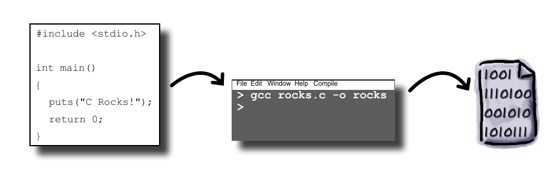

# Introdução 

## Como a linguagem C funciona



Primeiro temos que escrever o código fonte, que é escrito de forma legível aos seres humanos, logo depois o código será compilado. O final do processo resulta em um novo arquivo que possui um código composto de uma sequência 0 e 1, linguagem de maquina,  que é compreensível  para a máquina, ou seja, ela pode executar.

## Primeiro Código

Código final :

```c
#include <stdio.h>
int main(){
  printf("Ola mundo \n");
  return 0;
}
```

### Analise do código

```c
#include <stdio.h>
```

Isso é uma declaração de bibliotecas que serão usadas no programa. Bibliotecas é um conjunto de funções, as quais o programador pode utilizar.  A biblioteca *stdio.h* significa Standard Input and Output Header , ou seja , "Cabeçalho padrão de entrada e saída" , ela fornece funções úteis para entrada (receber informações do teclado) de dados e saída(exibir mensagens na tela).

```c
int main()
```

A função main() é o ponto de partida do programa, por isso é essencial que todo programa tenha uma função main()

O corpo da função main(), como qualquer outra função, é delimitado por chaves "{...}" :

```c
int main(){corpo da função main}
```

Veja que a "int" precede a função main(), essa parte indica que a função irá retornar um "int",ou seja, um inteiro (0,1,2,3...). 

Uma parte importante para fiscalizar se um programa foi executado com sucesso :

```c
return 0;
```

Não é muito importante se preocupar o que significa isso, mas é importante que todo código tenha esse trecho. Mas como havíamos dito, a função  main() retorna um inteiro, nesse caso retorna o "0" caso seja bem sucedido, mas o número zero não é explicitamente exibido ao executar , então não influencia muito. 

> Observação interessante :
>
> A parte seguinte parte ,apesar de ser importante, pode ser omitida :
>
> ```c
> return 0;
> ```
>
> O código final seria :
>
> ```c
> #include <stdio.h>
> int main(){
>   printf("Ola mundo \n");
> }
> 
> ```
>
> Esse código ainda está correto.

