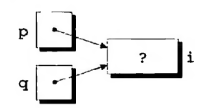

# Ponteiros

Definição mais simples :

> Ponteiros é uma variável que armazena o endereço de um local na memória.

Perceba que ponteiros são variáveis, então eles também estão em algum endereço da memória.


Um ponteiro guarda o endereço de outra variável como mostra na figura acima.


# Uso

Para declarar um ponteiro basta usar a seguinte expressão :

```
<tipo do ponteiro> * <nome>;   
```

> O uso de espaços em branco ao redor do asterisco * é irrelevante.

O operador asterisco ( * ) informa ao compilador que a variável não guarda um valor, mas sim um endereço de memória.

É importante se atentar ao tipo do ponteiro, esse tipo precisa corresponder com o tipo da variável do endereço guardado. 

```
int * p --> Aponta para uma variável do tipo int
float * p --> Aponta para uma variável do tipo float
char * p --> Aponta para uma variável do tipo char
```

 A forma mais fácil de ler um ponteiro é da direita para esquerda :

> variável de nome p :
>
> int * **|** p **|**
>
> *p* é um ponteiro :
>
> int **|** * p **|**
>
> p é um ponteiro que aponta para um int ( inteiro ) :
>
> **int * p**

Cuidados importantes :

> Na linguagem C é possível declarar múltiplas variáveis de uma única vez :
>
> ```c
> #include <stdio.h>
> 
> int main() {
>  int a,b;
>  a = 4;
>  b = 6;
> 
> }
> ```
>
> O exemplo acima ilustra a declaração das variáveis do tipo int : a, b.
>
> Entretando, isso não é tão simples para ponteiros :
>
> ```c
> int *xPtr, x;
> ```
>
> Pode parecer uma declaração de múltiplos ponteiros, mas não é verdade , o que temos é :
>
> 1. *xPtr --> Ponteiro que aponta para um int
> 2. x --> variável do tipo int
>
> O que define se é uma variável ou um ponteiro é a presença do ( * ).
>
> A forma correta de declarar múltiplos ponteiros de uma única vez é :
>
> ```c
> int *aPtr, *bPtr;
> ```
>
>  Então, vamos fazer um exemplo mais interessante :
>
> ```c
> int *a, *b , c;
> ```
>
> Temos dois ponteiros : a, b ; uma variável do tipo int : c.

# Inicialização E Atribuição

Se um ponteiro não for inicializado ( não conter nenhum endereço), ele aponta para um lugar indefinido, isso ocorre quando um ponteiro é apenas declarado:


> Um ponteiro pode apontar para "lugar nenhum" , também conhecido pelo valor NULL.
>
> Para isso há duas formas de se fazer.
>
> A primeira forma é atribuir o valor constante NULL para um ponteiro :
>
> ```C
> int *p = NULL;
> ```
>
> A segunda forma é atribuir o valor inteiro 0 para o ponteiro :
>
> ```c
> int *p = 0;
> ```
>
> 
>
> O seguinte código ilustra uma forma de observar ao executar um programa :
>
> ```c
>   #include <stdio.h>
> 
> int main(void) {
>   int *a,*b; // Declaramos dois ponteiros a e b
>   a = NULL; // Apontamos o ponteiro a para lugar nenhum
>   b = 0; // Apontamos o ponteiro b para lugar nenhum
>   
>   printf("O ponteiro a ponta para %p \n",a);// %p exibe valores hexadecimal
>   printf("O ponteiro b aponta para %p \n",b); 
> }
> ```
>
> O resultado deve ser algo parecido com o seguinte :
>
> 

## Operador de endereçamento ( & )

O operador & retorna o endereço de alguma variável.

>  Um teste rápido para ver o operador em prática :
>
> ```c
> #include <stdio.h>
> 
> int main(){
> 	int n = 4;
> 	printf("O local da variavel n : %p \n",&n);
> }
> ```
>
> O esperado ao executar é receber o endereço onde a variável n se encontra :
>
> 

O processo de atribuir valores para um ponteiro é relativamente simples :

```
<tipo> * <nome-do-ponteiro> ;
<nome-do-ponteiro> = &<variavel>
```

Exemplo :

```c
int b = 4;
int *bPonteiro;
bPonteiro = &b;
```

Assim temos que o ponteiro declarado bPonteiro recebe o endereço da variável *b* na linha 3.

O processo pode ser direto, o exemplo acima é equivalente a :

```c
int b = 4;
int *bPonteiro = &b;
```

> Vamos mostrar que um ponteiro realmente carrega o endereço de outra variável com o seguinte código:
>
> ```c
> #include <stdio.h>
> 
> int main(){
> 	int b = 10; // conteudo de b : 10
> 	int *bPonteiro = &b; // O conteudo do ponteiro : endereco da variabel b
> 	printf("O endereço da variabel b : %p \n",&b); 
> 	printf("O endereço carregado pelo pointeiro *bPonteiro : %p \n",bPonteiro);
>     printf("O endereco do ponteiro *bPonteiro : %p \n",&bPonteiro); 
> }
> ```
>
> O endereço da memória pode variar de execução para execução , o importante é notar que ambos os endereços são iguais :
>
> 
>
> Ponto interessante de sempre lembrar é o de que o ponteiro carrega um endereço de outra variável, entretanto, o próprio ponteiro está localizado em outra região da memória, uma região própria.

> Observação interessante:
>
> O nome de um array pode servir de ponteiro para o seu primeiro item. Lembre-se de que ao criar um array, a memória é alocada de forma sequencial para conter os itens.
>
> Veja o seguinte código, ele mostra o endereço (em octal) de cada item do array :
>
> ```c
> #include <stdio.h>
> 
> int main(){
> 	int num[4] = {1,2,3,4};
> 	printf("Endereço do item 1 : %o \n",&num[0]);
> 	printf("Endereço do item 2 : %o \n",&num[1]);
> 	printf("Endereço do item 3 : %o \n",&num[2]);
> 	printf("Endereço do item 4 : %o \n",&num[3]);
> }
> ```
>
> O resultado será algo parecido com :
>
> 
>
> Como cada inteiro é do tamanho é do tamanho de 4 bytes, logo o endereço de um item para o outro irá variar de 4 em 4. 
>
> Eles estão em sequência na memória :
>
> 
>
> De quatro em quatro os espaços são ocupados.
>
> 

## Operador de acesso / Derreferência ( * )

O operador ( * ) acessa o conteúdo de algum endereço.

Por exemplo :

```
int c = 10;
int *cPonteiro = &c;
```

 Temos um ponteiro cPonteiro apotando para uma variável *c* cujo valor é 10. Caso queira acessar o valor do endereço armazenado no ponteiro :

```
*cPonteiro
```

O valor retornado ao aplicar o asterisco ( * ) antes do ponteiro será 10, pois o asterisco permite acessar o valor de um determinado endereço. Então, o ponteiro carrega o endereço da variável *c*, se caso acessar esse endereço, o valor retornado será 10 ( o valor da váriavel *c*).

Outro exemplo :

```c
#include <stdio.h>

int main(){
	int num = 15; // Variavel num possui o conteudo 15
	int *numPont = &num; // Ponteiro com o endereco da variavel num
	printf("o endereco carregado pelo ponteiro tem o conteudo numerico : %i \n",*numPont);
}
```

 Como o ponteiro carrega o endereço da variável *num* , quando acessar o endereço dessa variável num usando o asterisco ( * ), teremos o valor retornado igual a 15.

Resultado :

 

> **Cuidados importantes** 
>
> Vamos analisar o seguinte código :
>
> ```c
> int i, *p , *q; // p e q sao ponteiros que apontam para o tipo int
> ```
>
> Primeira situação :
>
> ```c
> p = &i; // p possui o endereco da variavel i
> q = p // agora copiamos o endereco carregado por p para o ponteiro q
> ```
>
> Estamos copiando o endereço carregado pelo ponteiro p e atribuindo esse endereço para o ponteiro q. 
>
> 
>
> Agora os ponteiros *q* e *p* apontam para o mesmo endereço.
>
> Segunda situação :
>
> ```c
> *p = 1; // Altera o valor da variavel i para 1
> *q = 2; // Altera o valor da variavel i para 2
> ```
>
>  Ao usar ( * ) antes de um ponteiro declarado, o valor do endereço apontado por esse ponteiro é acessado, logo *p e *q acessam o valor da variável *i* . A variável *i* possui seu conteúdo alterado duas vezes , por isso é importante se atentar para o uso correto dos ponteiros.
>
> 
>
> 

# Arrays e Ponteiros

Ponteiros e arrays não são equivalentes, um simples código pode mostrar isso :

```c
int a[5]; // Array
int *b; // Ponteiro para int
```

Um array aloca espaço na memória para n elementos e depois devolve o endereço do primeiro elemento para a variável (isso é uma constante). Já o ponteiro cria espaço apenas para si mesmo, não o suficiente para outros elementos.

> Logo, o nome de um array é um ponteiro para o primeiro elemento do array.
>
> Veja o seguinte código e como o nome do array pode estar sujeito ao operador " * " da mesma forma que um ponteiro :
>
> ```c
> #include <stdio.h>
> // Codigo para mostrar a equivalencia do nome de um array com um ponteiro
> int main(void)
> {
>   int a[] = {1,2,3,4};
>   printf("%d \n",*a);
> }
> ```
>
> O resultado será o valor do primeiro elemento do array.


