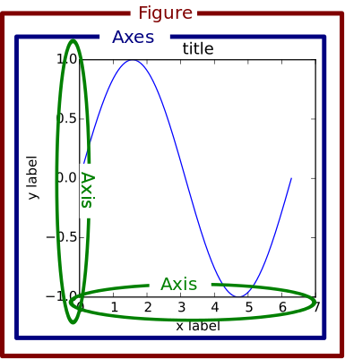

# Introdução

## Preliminares 

### Lista

Em python, lista é um tipo de estrutura de dados, ela é guarda itens de forma ordenada. 

Para criar uma lista basta inserir itens entre colchetes [ ] :

```python
lista = [1, 2, 3 , 4] # Essa é uma lista com quatro itens 
```

Por ela ser ordenada, cada item possui uma posição ( index ) na lista. Veremos isso melhor com outra lista :

```python
nomes = ["kleber","yasmim","jonas"]
```

Agora vamos interpretar cada item com sua posição na lista :

|   Item   | Posição (index) |
| :------: | :-------------: |
| "kleber" |        0        |
| "yasmim" |        1        |
| "jonas"  |        2        |

Isso é importante para acessar os itens de forma individual , para fazer isso precisamos usar a seguinte expressão :

```python
nome_da_lista[index_do_item]
```

Caso queira acessar o item "kleber", precisamos informar a posição dele na lista :

```python
nomes[0]
# Exibe o item na posição 0, o "kleber"
```

Para os demais :

```python
nomes[1]
# Exibe yasmim
nomes[2]
# Exibe jonas
```

### Juntando listas

Podemos "somar" os itens de uma lista com os de outra lista. Para fazer isso usamos o "+" entre duas listas:

```python
c = lista1 + lista2
```

Exemplo :

```python
a = [1,2,3]
b = [4,5,6]
```

Caso quisermos uma nova lista com a união dos itens da lista "a" e da lista "b":

```python
c = a + b
print(c)
>>>[1,2,3,4,5,6]
```

Veja que esse processo da origem a uma nova lista 

Entretanto, poderíamos modificar uma lista permanentemente  da seguinte forma :

```python
lista1.extend(lista2)
```

Isso é um comando para "estender" a lista1 para incluir os itens da lista2 , nesse processo não é gerado uma nova lista, o que ocorre é a modificação de uma lista existente :

```python
a = [1, 2, 3]
b = [4, 5, 6]
a.extend(b)
print(a)
>>>[1,2,3,4,5,6]
```

### Removendo itens da lista

A primeira forma é usando um método que remove o item fornecido :

```python
lista.remove(<item>) # Forneça o item, não a posição/index
```

Exemplo :

```python
nomes = ["mauricio","carlos","pedro"]
nomes.remove("mauricio")
# Agora a lista é ['carlos', 'pedro']
nomes.remove('pedro')
# Agora a lista é apenas ['carlos']
```

Esse método remove apenas a primeira ocorrência, caso haja um item duplicado, apenas um irá ser eliminado.

Para remover um item informando a posição podemos fazer isso de duas formas.

A primeira forma é  usando "del" , um comando capaz de deletar itens de listas,dicionário, inclusive variáveis.

```python
del <item>
```

Usando o del para deletar uma variável :

```python
a = "Olá"
print(a)
>>>Olá
del a 
print(a)
Traceback (most recent call last):
  File "<stdin>", line 1, in <module>
NameError: name 'a' is not defined
# Esse é um erro devido a falta de referência para alguma váriavel 'a'
```

Usando para deletar itens de uma lista :

```python
lugares = ['brasil','teresina','piaui']
del lugares[0]
lugares
>>> ['teresina','piaui']
del lugares[1]
lugares
>>>['teresina']
```

Outra forma de remover itens usando a posição/index  é usando o método pop() :

```python
lista.pop(<index>)
```

Esse método possui um efeito diferente dos demais, ele retorna o item que ainda vai ser deletado e em seguida deleta.

```python
lugares = ['brasil','teresina','piaui']
lugares.pop(0)
>>>brasil # O método pop() exibe o item que o foi deletado
# Caso queira ver como está a lista atual
lugares
>>>['teresina','piaui']
```

### Adicionando novos itens na lista

A melhor forma de se realizar isso é usando o método append() : 

```python
nome_da_lista.append(<item>)
```

Exemplo :

```python
nome = [] # Lista vazia
nome.append("Mauricio")
# Caso queira checar a lista agora
print(nome)
>>>['Mauricio']
```

### Atualizando valores

A forma de atualizar valores de uma lista é algo muito direto . Primeiro temos que lembrar como acessar o item de uma lista :

```
lista[<index>] # Acessa o item da lista como vimos anteriormente
```

Podemos alterar o valor desse item de uma forma bem simples :

```python
lista[<index>] = <valor>
```

Exemplo :

```python
canais = ['Verde','Azul','Preto']
canais[0] = 'Amarelo' # Isso altera o item no index 0 ('Verde') para 'Amarelo'
# Para ver como a lista está organizada
print(canais)
>>>['Amarelo','Azul','Preto']

# Alterando o item na posição/index 1 ('Azul')
canais[1] = 'Rosa'
print(canais)
>>>['Amarelo','Rosa','Preto']
```


### Aninhando listas 

Uma lista pode conter qualquer item, inclusive outra lista, é uma  ideia interessante para se pensar :

```python
pessoas = [["Mauricio", "Tarso", "Claudia"], [19, 18, 18]]
```

A lista *pessoas* contém dois itens, o primeiro item é uma lista com *nomes* e o segundo item é uma lista com *idades*. Como acessar cada lista e item de forma individual ? Vamos por passo.

```python
pessoas[<index>]
```

Usando o código acima, acessaremos os itens de pessoas, porém seus itens são listas, então :

```python
pessoas[0]
# Retorna a primeira lista
>>>['Mauricio', 'Tarso', 'Claudia']
```

```python
pessoas[1]
# Retorna a segunda lista 
>>>[19, 18, 18]
```

Então se sabemos que lista serão retornadas ao fazer isso, podemos, portanto, acessar os itens dessas listas(nome/idade) :

```python
pessoas[0][0] # Acessa o item no index 0 (uma lista), e logo em seguida acessa o item dela
>>>'Mauricio'
pessoas[0][1]
>>>'Tarso'
pessoas[0][2]
>>>'Claudia'
```

O mesmo processo pode ser feito pro segundo item da lista pessoas, que contém as idades :

```python
pessoas[1][0] # Acessa o item no index 0 (uma lista), e logo em seguida acessa o item dela
>>>19
pessoas[1][1]
>>>18
pessoas[1][2]
>>>18
```

  

## Aquecimento

### Importando

Antes de mais nada, não esqueça de importar o matplotlib para o seu programa :

```python
import matplotlib.pyplot
```

O pyplot é uma parte do matplotlib, essa forma de importar é a mais usual. Para facilitar a vida de programador e usar essa biblioteca de forma mais fácil.

```python
import matplotlib.pyplot as plt
```

Dessa forma, podemos fazer referência ao que acabamos de importar usando "plt", um nome bem mais simples e que reduz a dor de digitar demais. 

### Figures

Essa é a estrutura básica, é a janela onde o gráfico será exibido. Para comprovar isso :

```python
import matplotlib.pyplot as plt
figure = plt.figure()
plt.show()
```

> plt.show() é um comando que exibe todo o trabalho gerado até então pelo matplotlib , é necessário para exibir os gráficos gerados. Em certos programas como o Jupyter isso pode não ser necessário, como também no Ipython(que é a fundação básica do funcionamento do Jupyter).

Ao executar esse código, uma tela aparecerá :


Essa é a figure gerada pelo código. Podemos inclusive explorar ainda mais nosso código:

```python
import matplotlib.pyplot as plt
figure = plt.figure()
figura2 = plt.figure() # Adicionado
plt.show()
```

Ao executar esse código, teremos duas figures :


### Entendo os gráficos do matplotlib



Essa é uma ilustração destacando o nome de cada parte do gráfico.

### Subplots

Segundo a documentação oficial :

> Cria uma figure e um conjunto de subplots

Vamos entender melhor na prática com código, esse código :

```python
import matplotlib.pyplot as plt
plt.subplots()
# O que isso retorna é :
(<Figure size 640x480 with 1 Axes>, <matplotlib.axes._subplots.AxesSubplot object at 0x7f18b4731510>)
```

O retorno é uma Figure do tamanho 640x480 com apenas 1 Axes (Veja a seção anterior a essa).

Caso usarmos plt.show() :

```python
import matplotlib.pyplot as plt
plt.subplots()
# O que isso retorna é :
(<Figure size 640x480 with 1 Axes>, <matplotlib.axes._subplots.AxesSubplot object at 0x7f18b4731510>)
plt.show()
```

Uma janela abre em decorrência disso :


Vamos entender melhor o que é Axes. Vamos pedir ao subplots() para fornecer uma figure com 2 axes :

```python
import matplotlib.pyplot as plt
plt.subplots(2)
# O que isso retorna é :
(<Figure size 640x480 with 2 Axes>, array([<matplotlib.axes._subplots.AxesSubplot object at 0x7f18b431f810>,
       <matplotlib.axes._subplots.AxesSubplot object at 0x7f18b4517390>],
      dtype=object))
```

Isso retorna uma Figure do tamanho 640x480 com 2 axes. Vamos exibir com o plt.show() :

```python
import matplotlib.pyplot as plt
plt.subplots(2)
# O que isso retorna é :
(<Figure size 640x480 with 2 Axes>, array([<matplotlib.axes._subplots.AxesSubplot object at 0x7f18b431f810>,
       <matplotlib.axes._subplots.AxesSubplot object at 0x7f18b4517390>],
      dtype=object))
plt.show()
```

Uma janela figure com 2 axes abre :


