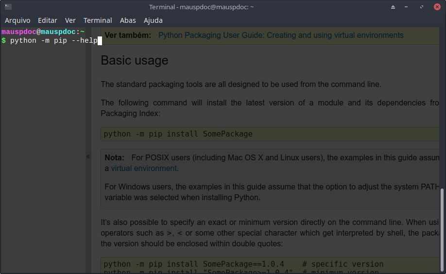
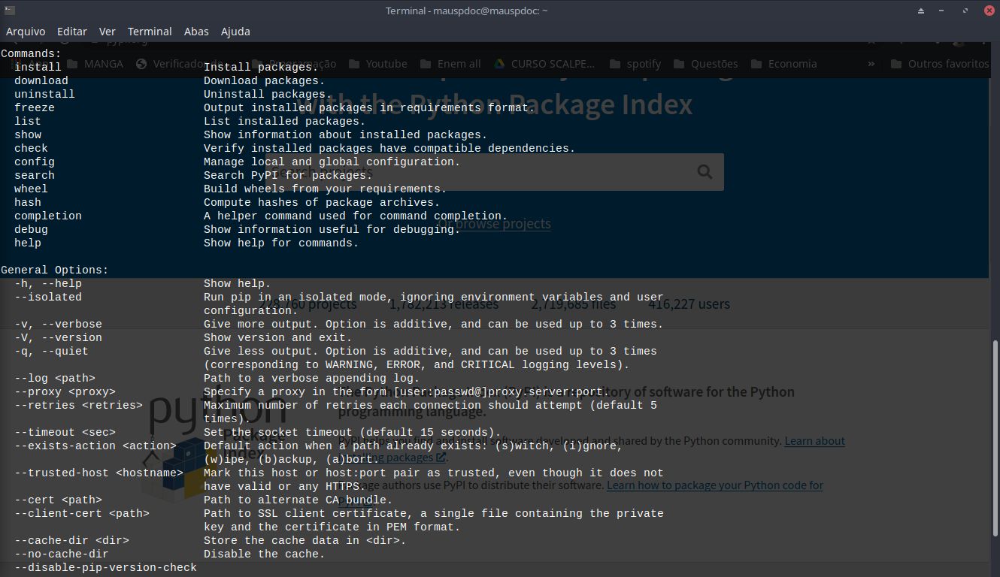
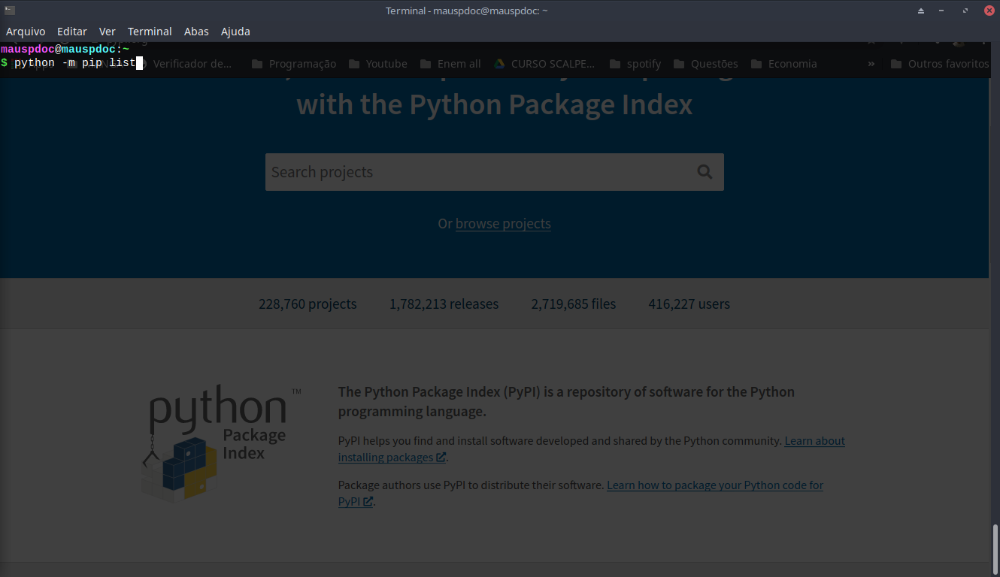
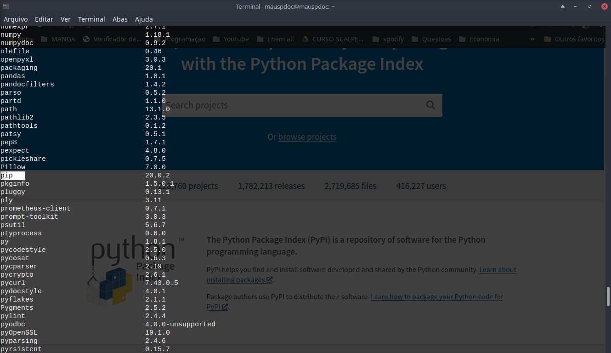

# PIP 

Segundo a wikipédia :

> pip é um sistema de gerenciamento de pacotes padrão de facto usado para instalar e gerenciar pacotes de software escritos em Python. Muitos pacotes podem ser encontrados na fonte padrão para pacotes e suas dependências - Python Package Index. A maioria das distribuições do Python vem com o pip pré-instalado.

Pip permite instalar pacotes e gerenciar de forma fácil. Ele atualmente já vem pre-instalado nas versões Python 3.4 ou superiores. 

Para usar entre no terminal no sistema operacional, no sistema Windows é feito através do CMD ou prompt de comando, enquanto que no Linux há várias versões, porém pelo comando CTR+ALT+T acessa automaticamente.

Na tela de comando:


Esse é um formato de invocar o python , o comando "-m" indica que acessaremos um *módulo* python, logo após esse comando devemos fornecer o  nome do módulo. O próprio módulo em si também pode conter opções que são acessíveis  pelo terminal, por isso qualquer comando que seja referente ao módulo deve ser escrito logo após invocar o nome dele.



Nesse caso, o python receberá a informação de que deve acessar um módulo chamado pip, pois o pip em si é um pacote, logo após de invocar o pip, forneço o seguinte comando --help. Esse comando do pip fornece instruções de uso:



Esses são as instruções de uso do PIP depois de entrar com o código python -m pip --help.

Agora iremos listar todos os pacotes instalados no python em questão. Para isso use o comando list do pip 



Ao entrar com esse comando :



Veja que na própria lista é citado o pip . 

Caso queira instalar pacotes adicionais, use o seguinte comando:

```
python -m pip install <nome-do-pacote>
```

Para saber o nome do pacote para instalar, uma das formas é pesquisar através do site oficial, onde os pacotes adicionais python são agrupados. 

Esse é o pypi cujo endereço é https://pypi.org/ :


Um dos pacotes que exemplificarei será o *Pandas*, então posso pesquisar nesse site para mais informações.


Veja que há um retângulo contendo já o código para instalar :

```
pip install pandas
```

Esse código é para ser executado sobre o PIP , por isso devemos sempre invocar o PIP no terminal como fizemos antes e depois fornecer o comando:

```
python -m pip <comandos>
```

Sabendo disso tudo, para instalar o pacote Pandas, devemos fazer o seguinte código no terminal:

```
python -m pip install pandas
```

